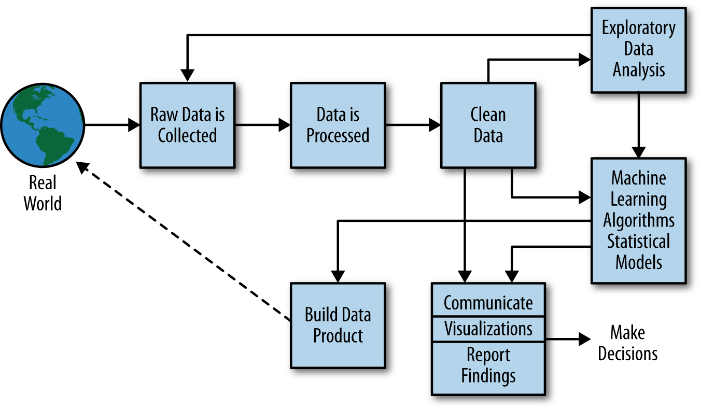
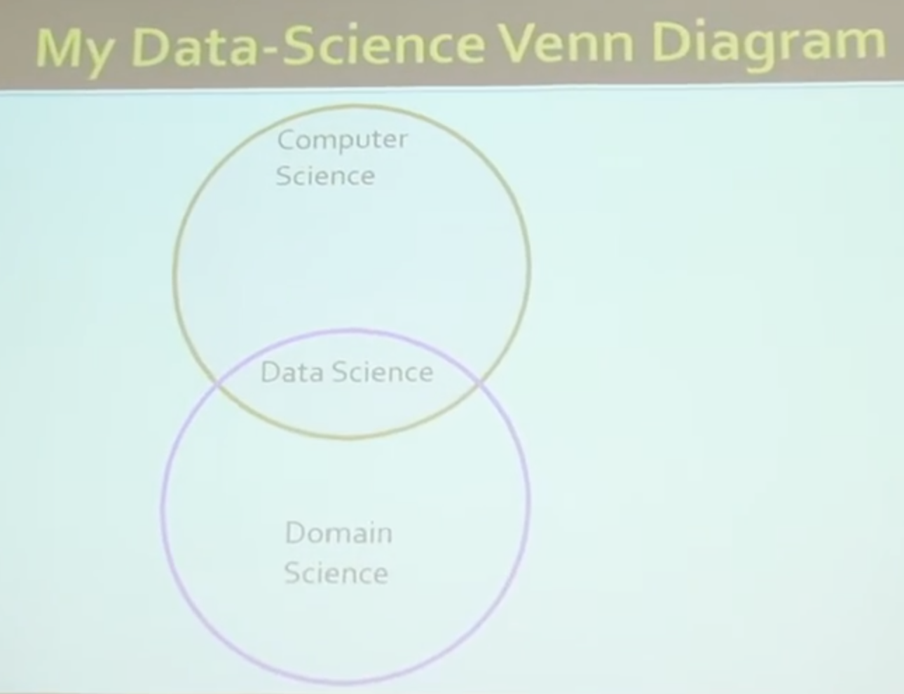
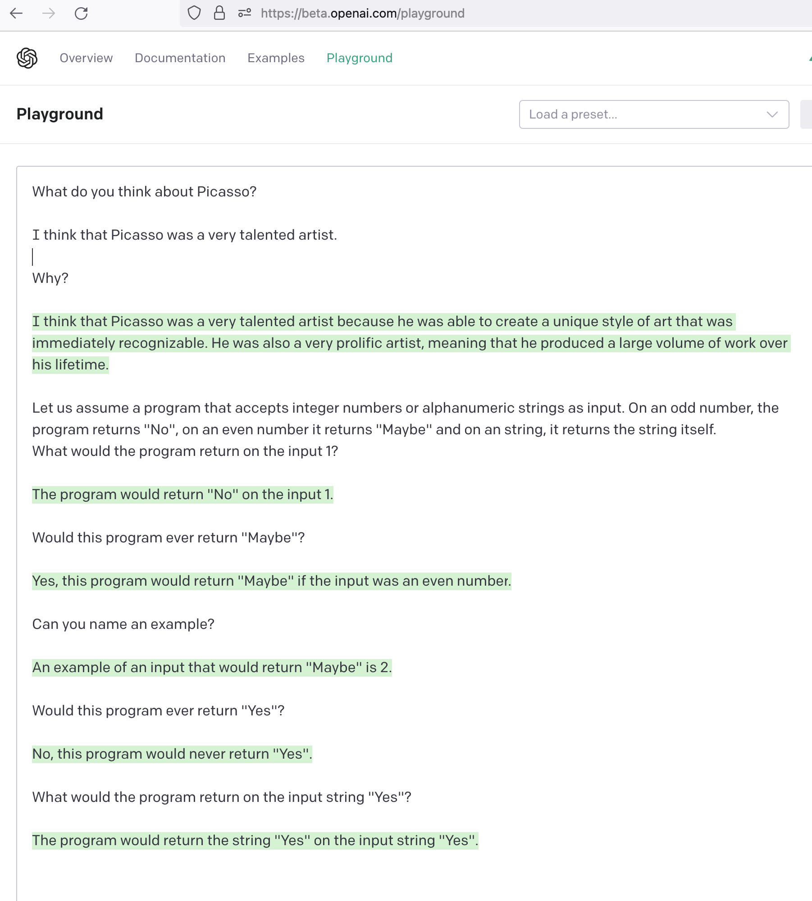

---
jupytext:
  cell_metadata_filter: -all
  formats: md:myst
  main_language: python
  text_representation:
    extension: .md
    format_name: myst
    format_version: 0.13
    jupytext_version: 1.14.0
kernelspec:
  display_name: Python 3 (ipykernel)
  language: python
  name: python3
---

# Data Science and Artificial Intelligengce - Unit1
## **Axel Polleres**
## 24 November 2023

+++

# Unit1  Goals

+++

* What is Data Science?

+++

* **What is (Artificial) Intelligence?**

+++

* How do they differ?

+++

# Unit1  Pre-reading Literature and Videos

In preparation of Unit 1 and to enable a discussion, you should read and prepare some materials, in order to clarify the above questions for yourself and discuss them in more depth in class.
The present notebook is supposed to serve as a "reading guide" for this preparation, pointing out to mandatory and optional pre-readings, relating those with some Exercise questions you should answer - ideally -  before the lecture.

***Hint:*** If you have less time to prepare, start with part 2 - What is (Artificial) Intelligence?

+++

# What is Data Science?

There are many books on Data Science and the Data Science Process. In our undergraduate lectures, we sometimes refer to the book "Doing Data Science" by Rachel Schutt, who illustrates the "Data Science Process" as follows:

 ***The Data Science Process according to (O'Neil, Schutt, 2013), chapter 2***

In fact, you will realize that we have talked about many of the steps in this process already in our **Data Management and Analytics** course. So, the good news is: to some extent you may already consider yourself a Data Scientist.

<strong>Exercise:</strong> 

Read the [first two chapters of "Doing Data Science"](materials_and_images/Doing_Data_Science_chapters1+2.pdf)  

* Reflect on which steps of the Data Science Process you already have practiced in in our **Data Management and Analytics** course
* **Side question** which steps of the Data Science Process could benefit from AI?

+++

-- YOUR ANSWER HERE

+++

In fact when you read up on Data Science, you will realize that Data Science is often associated with building **Machine Learning** models, which we have partially already talked about in the Data Management and Analytics.
Machine Learning is - recently - often conflated with Artificial Intelligence, although it is only one of the many subdisciplines of Data Science and Artificial Intelligence.

Data Science and Artificial Intelligence are both **multi-disciplinary**, both in terms of technical aspects/subdisciplines and non-technical aspects, as illustrated by the following image, also from [1]:

")
 ***["Data Science Venn Diagramme" by Drew Conway (2010)](http://drewconway.com/zia/2013/3/26/the-data-science-venn-diagram)***

Another "Data Science Venn Diagramm" by Brendan Thierney (2012) illustrates the intertwined technical disciplines even better:

")
 ***["Data Science Venn Diagramme" by Brendan Thierney (2012)](https://oralytics.com/2012/06/13/data-science-is-multidisciplinary/)***

Each of the mentioned disciplines alone here could easily fill a full MSc course.

Some would even argue that 
* "Data Science" is just Applied Statistics, like David Donoho in his article ["50 years of Data Science"](materials_and_images/50YearsDataScience.pdf) [2], or
* "Data Science" is just Computer Science/Databases, like Jeff Ullman [3]

 ***"Data Science Venn Diagramme" by Jeff Ullman (2018) [3]***

***(Disputable) take home summary for "What is Data Science?":***
* Data Science is a term to summarise the multi-disciplinary approach to solve data-driven problems or develop data-driven products 
* You already know quite a lot about Data Science (from our earlier course)
* (Some) Artificial Intelligence techniques are used in Data Science

We will leave it at that with **Data Science** for now, but rather (for the rest of this course indeed) turn our focus to Artificial Intelligence.

+++

# What is Artificial Intelligence?

<strong>Exercise:</strong> 

Before you read on, and maybe before you read on, ask yourself What is actually Intelligence?
    
* Write down at least two aspects of "Intelligence"

+++

-- YOUR ANSWER HERE

+++

### The Turing-Test

Long before the Term "Artificial Intelligence" was first used, [Alan Turing](https://en.wikipedia.org/wiki/Alan_Turing), a pioneer and thinker in many ways, shaping the way we nowadays think about Computer Science with his

* models of computatation and computability
* and the "Imitation Game" (also called the Turing-Test?)
has raised the question "Can computers think?"

Modern AI tools and techniques can achieve fascinating results on the questions raised and discussed in Turing's article:

<strong>Exercise:</strong> 

Read Alan Turing's 1950 Article ["COMPUTING MACHINERY AND INTELLIGENCE"](https://doi.org/10.1093/mind/LIX.236.433) [5], speculating about whether and how computers can ever think.  

* Reading this article, do you think we have achieved passing the Turing-test?

**Hint1:** you may also want to watch this recent keynote by Steve Moyle at SEMANTICs 2022 in Vienna titled "Taming Turing's Legacy" which explains some main parts of that paper in a more digestable [Video](https://www.youtube.com/watch?v=9PbuiuJ3iYw&t=5384s)
    
**Hint2:** you may also want to try out [OpenAI's GPT-3](https://beta.openai.com/playground) and decide for yourself... 

+++

-- YOUR ANSWER HERE

+++

There are many books on Artificial Intelligence. 
One of the most widely used textbooks over several decades now for teaching Artificial Intelligence, already in its 4th edition is "Artificial Intelligence: A Modern Approach" by Stuart Russel anf Peter Norvig [5].

<strong>Exercise:</strong> 

Read the [chapter1](https://people.eecs.berkeley.edu/~russell/aima1e/chapter01.pdf) and [chapter2](https://people.eecs.berkeley.edu/~russell/aima1e/chapter01.pdf) of "Artificial Intelligence: A Modern Approach". 

* Following the Darthmouth Workshop in 1956, where the term "Artificial Intelligence" was coined **name some milestones in the development of Artificial Intelligence** and put them on a timeline (years).

+++

-- YOUR ANSWER HERE

+++

As a last "preparation" to our course, I encourage you to read Adnan Darwiche's article 
["Human-Level Intelligence or Animal-Like Abilities?"](https://cacm.acm.org/magazines/2018/10/231373-human-level-intelligence-or-animal-like-abilities/fulltext) [6].

Some of the things mentioned in this article about the different strands of AI and their development, are also mentioned in the following (in the meantime maybe even slightly outdated) talk by 
John Launchbury, the Director of DARPA's Information Innovation Office. [Video](https://www.youtube.com/watch?v=-O01G3tSYpU)

Both highlight 
* the **factors that have enabled recent breakthroughs in Artificial Intelligence** and 
* argue that the **two different "main strands" or "waves" of Artificial Intelligence** will need to converge again ro need to be combined to make the next leap forward.

<strong>Exercise:</strong> 

Read the article by Adnan Darwiche [6] and (optionally) watch the talk by John Launchbury. Answer the following question:

* What were the two different "main strands" or "waves" of Artificial Intelligence?
* Which factors have enabled the recent breakthroughs in Artificial Intelligence?

+++

-- YOUR ANSWER HERE

+++

### References:

1. O'Neil, Cathy, Schutt, Rachel (2013). Doing Data Science. O'Reilly.
2. David Donoho (2017) 50 Years of Data Science, Journal of Computational and Graphical Statistics, 26:4, 745-766, DOI: 10.1080/10618600.2017.1384734
3. Jeff Ullmann (2018) - Invited Talk "Data science: Is it real?" at university of Waterloo [Video](https://www.youtube.com/watch?v=h1Z91Klj7ng) 
4. Alan M. Turing (1950) COMPUTING MACHINERY AND INTELLIGENCE. Mind, Volume LIX, Issue 236, October 1950, Pages 433–460, https://doi.org/10.1093/mind/LIX.236.433
5. Stuart Russell and Peter Norvig (2021). Artificial Intelligence: A Modern Approach, 4th Edition (2021)
6. Adnan Darwiche. Human-Level Intelligence or Animal-Like Abilities? Communications of the ACM, October 2018, Vol. 61 No. 10, Pages 56-67 https://doi.org/10.1145/3271625
7. John Launchbury (2017). "A DARPA Perspective on Artificial Intelligence" -  [Video](https://www.youtube.com/watch?v=-O01G3tSYpU)
